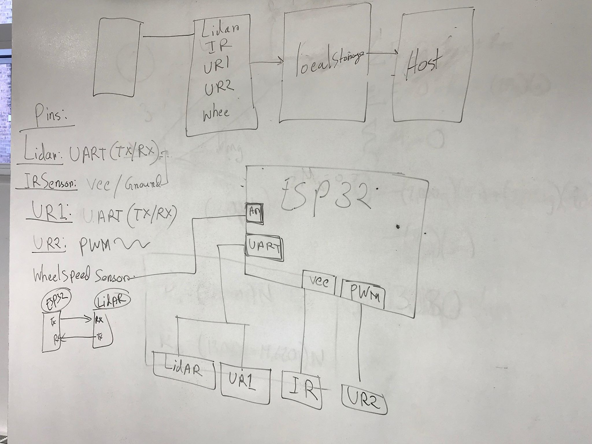
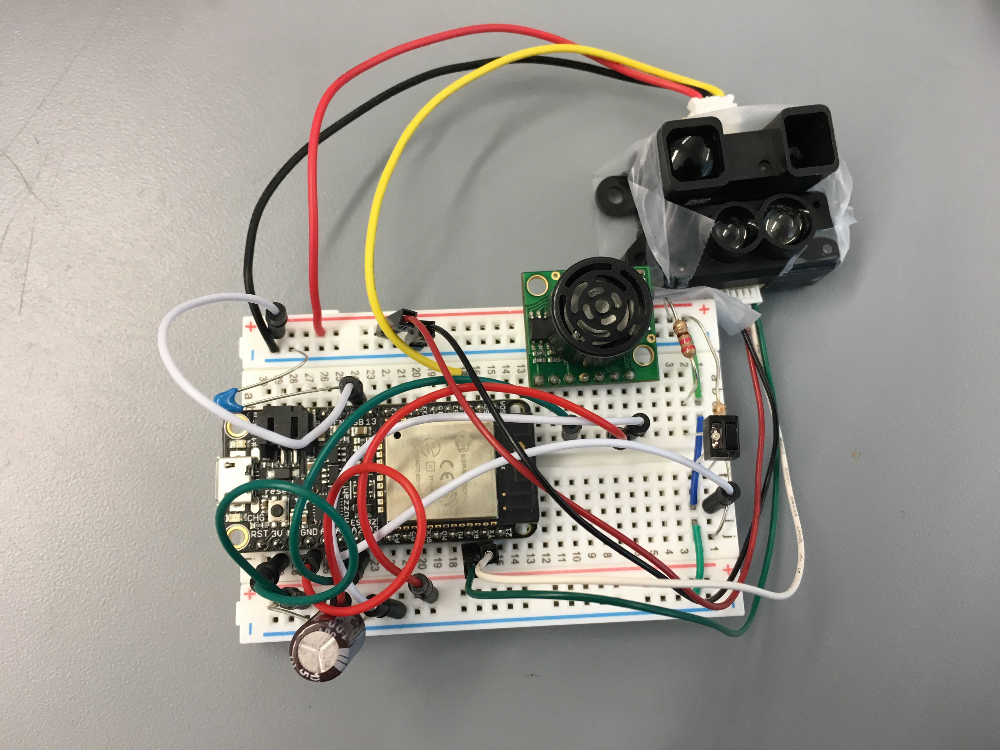
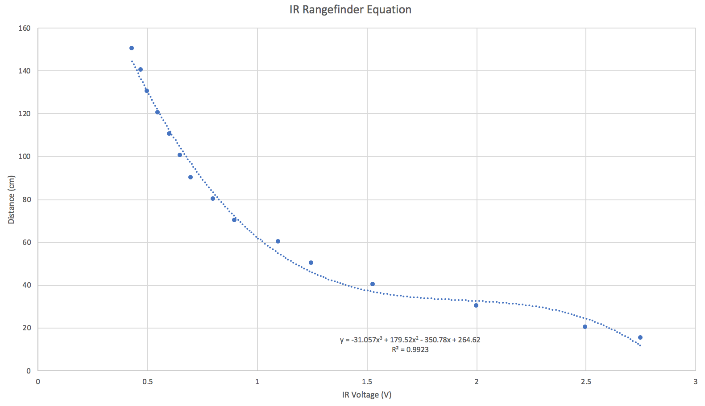

#  Quest #2: Swiss Army Tape Measure

Author: Mahdiul Chowdhury, Carlos Callejas, Devin Chen 2018-10-12

## Summary

For the first ultrasonic sensor, we used adc with an attenuation of 0 which we found allowed the voltage to change based on a distance of at least 30cm. We plotted several distances and voltages and found that it fit a linear trendline and applied that to output the appropriate distance.

The IR sensor was very similar to the ultrasonic in that we also used adc but used a higher attenuation due to the greater input voltage. There was a polynomial trendline which fit the distances and voltage based on the datasheet. We verified that the distances reported was consistent with the datasheet.

The wheel speed sensor was coded to detect a rising edge or when the wheel, which we covered half with white paper,  transitions from the black half to the white half. Using the built in timer functions, we measured the time it took for one period by taking the difference of the current count from the old count and calculating the speed, saving the current count into the old count for when the next rising edge comes around and then output the speed. This sensor also ran on a separate task from the other sensors as when they were on the same task, it would not poll the rising edge consistantly. 

We used LiDAR TFmini infrared module to detect the distance from an object to compare the output with IR and ultrasonic sensor. It reads the distance by sending the infrared light, which hits an object and recieve the reflection from the object. Basically it calculates the difference or phase difference between the light sending and the light reflection. It's a serial device UART coummnication, reading 9 bytes of data, such as accoridingly, header1, header2, LSB of distance and MSB of distance etc.That is why, we had to verify the header1 and header2 first, then shift the MSB by 8 bits and output the data which is the distance between the object and the sensor. 

We decided to output the data with the name/tag of the sensor followed by the data from that sensor. In the index.html, we parsed the output from the serial port and sent the appropriate datapoints to canvasjs which outputted all the distance measuring data on one chart and the wheel speed on another.

We were not able to get duration data using the RMT Rx module for the Sparkfun Ultrasonic sensor. Output from the Rx module were all rmt item32_t objects with all zero durations and levels. This could not be true, as we wired an LED in parallel to the Rx GPIO pin and it would effectively light up as we would expect (short burst for close range, more visible light pulse for long range).

## Sketches and Photos

The first sketch which helps outline the initial thought process for all the sensors.

Wiring and setup

The plot and trendline of the IR sensor

## Modules, Tools, Source Used in Solution

ESP 32 data sheet 
ESP-IDF Examples:
* MCPWM 
* RX/TX
* ADC1

## Supporting Artifacts

- [Demo](https://drive.google.com/open?id=1V2zyUFgntANl-Ls2WBDZFMVqZ8DPpc-8)
- [Github Repo](https://github.com/BU-EC444/Quest2-Team14-Callejas-Chen-Chowdhury/)

-----

## Reminders
- Please remember to post a link to this report.md file on [Piazza](https://piazza.com/class/jja9ukam6dp48f)
- Repo is private
